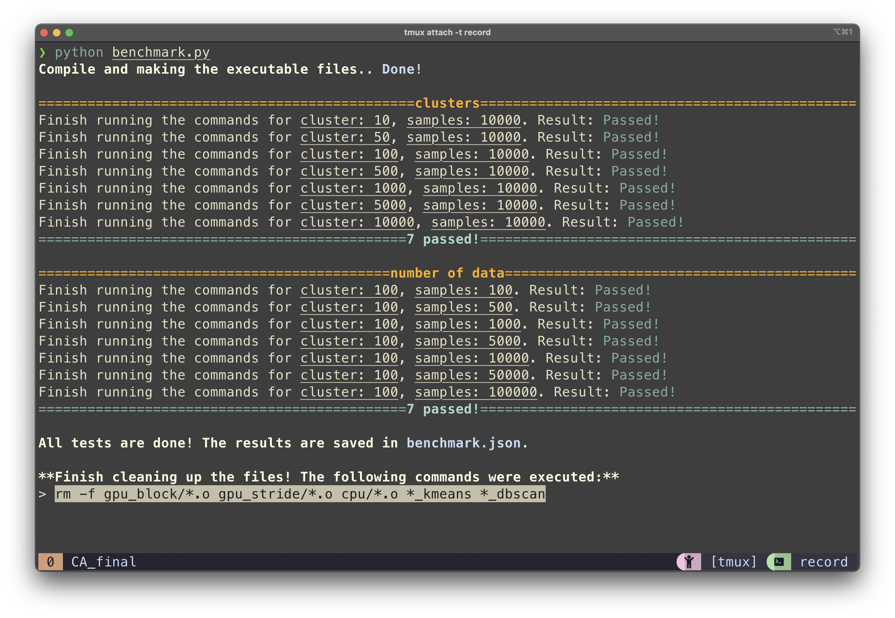
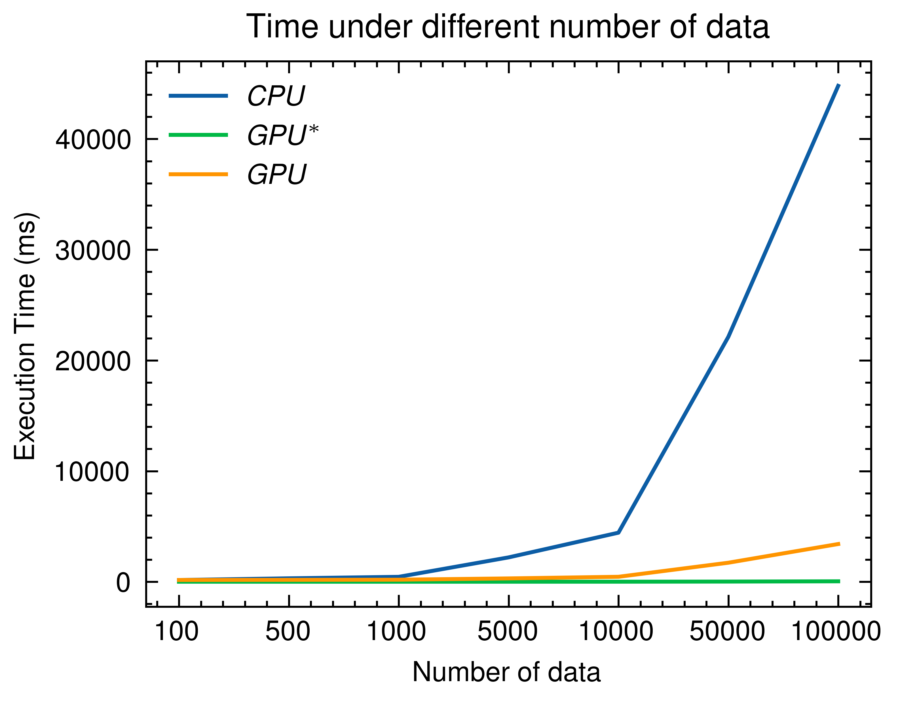
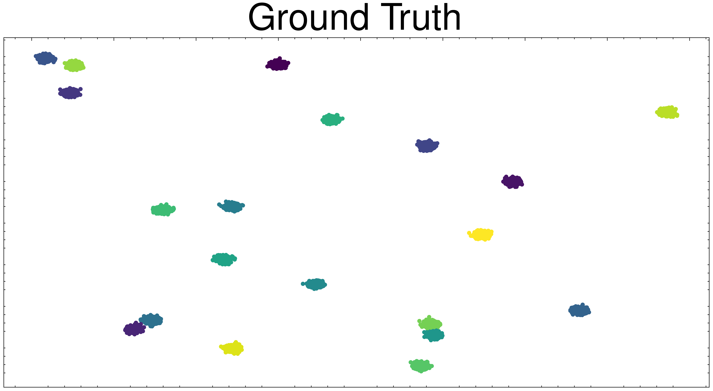

# README

## Setup

### 1. Install python dependices

```shell
> pip install requirements.txt
```

### 2. Modify the cuda path

Please make sure the cuda path is correct in `Makefile`.

```shell
# For example
LIBDIRS=-L/usr/local/cuda-11.7/lib64
INCLUDES=-I/usr/local/cuda-11.7/include
```

## Execution

To run the benchmark we prepared, please execute:

```shell
> python benchmark.py
```



To generate the plot from `benchmark.json` generated by above execution, please use:

```shell
> python generate_plot_from_json.py
```

<p align="center">
    
    
</p>

## Data Generation

Users can generate data by running

```shell
> python utils/generate_cluster.py \
    --n_samples <number of samples> \ 
    --n_features <number of features> \ 
    --n_centers <number of centers>
```

<p align="center">

</p>

## Compile

To compile only the wanted program, users can use `make <program name>`

| allowed program name  |
| --------------------- |
| cpu_kmeans            |
| gpu_block_kmeans      |
| gpu_stride_kmeans_imp |
| gpu_stride_kmeans_ori |

To run the executable file, please use:

```shell
> ./<program name> <num clusters> <max iterations>
```
